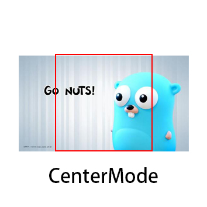
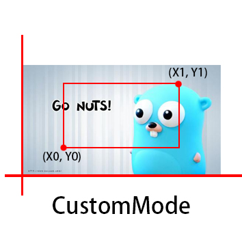
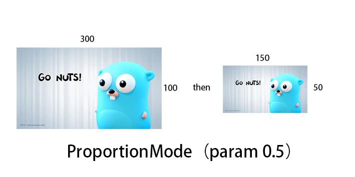
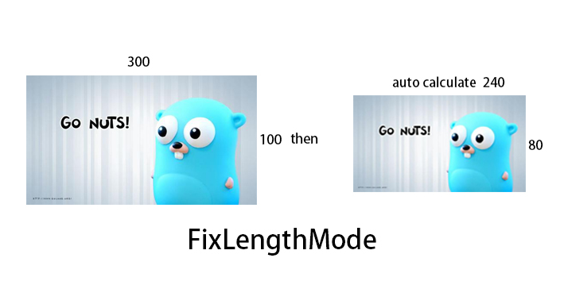

# imagescaling
	imagescaling is a go lib for clip or scaling image. support for jpg/png/bmp/gif 【chaining operations】
	
	imagescaling 是一个go图片 裁剪&缩放 库。 支持 jpg/png/bmp/gif 格式， 【链式操作】
### 1.get
```bash
go get github/chi-chu/imagescaling
```
### 2.Mode Explain
* **CenterClip()**  &emsp;Api example:  
	&emsp;&emsp;  
	
* **CustomClip(x0, y0, x1, y1 uint)**  &emsp;Api example:  
	&emsp;&emsp;  

* **ProportionScale(p float64)** &emsp; Api example:  
	when p=0.5
	&emsp;&emsp;  
	
* **FixScale(height, width uint)** &emsp; Api example:  
	when width=0  height=80
	&emsp;&emsp;  

* **ReSet()**  &emsp; Api Desc:  
	&emsp;&emsp;Recover the image to original data
* **GetExt()** &emsp; Api Desc:  
	&emsp;&emsp;Get the file type **jpg/png/bmp/gif**
### 3.Usage
```golang
import github/chi-chu/imagescaling

func main(){
	imageData, err := os.Open("/your/image/path/filename.jpg")
    if err != nil {
        panic(err)
    }
    defer imageData.Close()
    img, err := imagescaling.New(imageData)
    if err != nil {
        panic(err)
    }
    outPutPath := "/your/output/image/path/filename."+ img.GetExt()
    fd, err := os.OpenFile(outPutPath, os.O_RDWR|os.O_CREATE|os.O_TRUNC, 0777)
	if err != nil {
		panic(err)
	}
	defer fd.Close()
	err = img.CustomClip(100,23,400, 300).FixScale(100,0).Draw(fd)
	if err != nil {
		panic(err)
	}
}
```